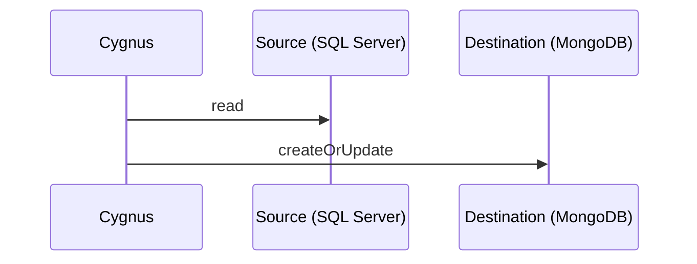

# Cygnus

Cygnus is a free open source data synchronization tool.

## Use case

```mermaid
sequenceDiagram
  Cygnus->>Source (SQL Server): read
  Cygnus->>Destination (MongoDB): createOrUpdate
```

## Quick start

TODO

## Contribue

TODO
