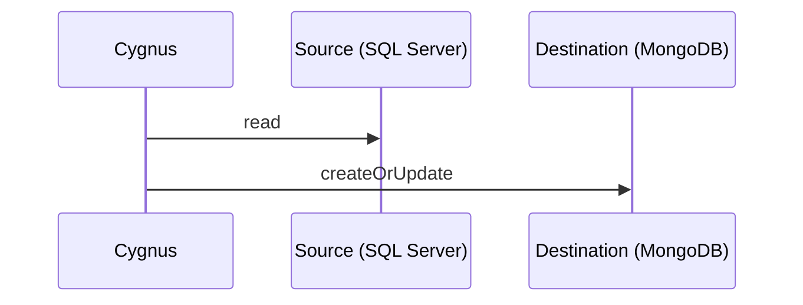

# Cygnus

[](https://gitlab.com/kalosyni/cygnus/-/pipelines)
[](https://sonarcloud.io/summary/new_code?id=kalosyni_cygnus)
[](https://sonarcloud.io/summary/new_code?id=kalosyni_cygnus)
[](https://www.nuget.org/packages/cygnus)

Cygnus is a free open source data synchronization tool.

## Use case

Given two data stores that needs to be synchronized, Cygnus is the right tool to do it efficiently.



## Quick start

Cygnus is a .NET global tool. It only requires to have [.NET SDK](https://dotnet.microsoft.com/download) installed to run.

```bash
# installs the tool on the system
dotnet tool install --global cygnus

# displays help
cygnus --help

# synchronizes data
cygnus -f <definition_yaml_file> -c <configuration_yaml_file>
```

## Samples

Sample files: [settings.json](./samples/settings.json), [sqlserver-to-mongodb-migration.yml](./samples/sqlserver-to-mongodb-migration.yml)

```bash
# runs the tool with verbose messages
run -v -f ./samples/sqlserver-to-mongodb-migration.yml -f ./samples/settings.json
```

## Contribute

### Tooling

* Container runtime: [Docker Engine](https://docs.docker.com/engine/install/), [podman](https://podman.io/) or any other engine
* Git client: [git CLI](https://git-scm.com/) and/or any other git client (such as [GitKraken](https://www.gitkraken.com/))
* IDE: [Visual Studio 2022](https://visualstudio.microsoft.com/fr/vs/), [Visual Studio Code](https://code.visualstudio.com/)
or [Rider](https://www.jetbrains.com/rider/)
* SDK: [.NET 6.0 (or higher)](https://dotnet.microsoft.com/download)

### Backing services

* Local databases for tests and debug

```bash
# runs SQL Server in a container and creates some data
MSSQL_HOST=mssql
MSSQL_PASSWORD='s0m3Str0ng!P@ssw0rd'
docker run --name $MSSQL_HOST \
  -e "ACCEPT_EULA=Y" -e "SA_PASSWORD=$MSSQL_PASSWORD" -p 1433:1433 \
  -d mcr.microsoft.com/mssql/server:2019-latest
docker cp $PWD/samples/db-init.sql mssql:/home/db-init.sql
docker exec $MSSQL_HOST /opt/mssql-tools/bin/sqlcmd -S localhost -U SA -P $MSSQL_PASSWORD -i /home/db-init.sql

# runs MongoDB in a container
MONGODB_HOST=mongodb
docker run --name $MONGODB_HOST -d -p 27017:27017 mongo:5.0
```

### Debugging

* Create `src/ConsoleApp/Properties/launchSettings.json` file with the following content
(this file is ignored by git as it can change between developer work environment)

```json
{
  "profiles": {
    "ConsoleApp": {
      "commandName": "Project",
      "commandLineArgs": "run -v -f ../../../../../samples/sqlserver-to-mongodb-migration.yml -f ../../../../../samples/settings.json"
    }
  }
}
```

* Start debugging ConsoleApp project in Visual Studio

### Validating the global tool

```bash
# packages the application
dotnet pack

# installs the tool from a local build
dotnet tool install --global --add-source ./nupkg cygnus --version 1.0.1-alpha-000000

# removes the tool
dotnet tool uninstall --global cygnus
```

### Additional information

* [Automation](./docs/automation.md)

### Examples with other technologies

* [dannysofftie/mysql-mongo-etl](https://github.com/dannysofftie/mysql-mongo-etl)
* [anlek/mongify](https://github.com/anlek/mongify)
