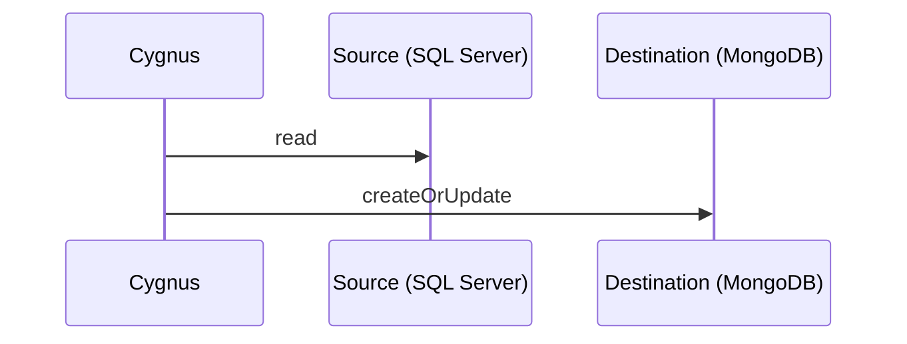

# Cygnus

[](https://gitlab.com/kalosyni/cygnus/-/pipelines)
[](https://sonarcloud.io/summary/new_code?id=kalosyni_cygnus)
[](https://sonarcloud.io/summary/new_code?id=kalosyni_cygnus)
[](https://www.nuget.org/packages/cygnus)

Cygnus is a free open source data synchronization tool.

## Use case



## Quick start

Cygnus is a .NET global tool so all you need to to is install the latest [.NET SDK](https://dotnet.microsoft.com/download)
and run the following command:

```bash
# installs
dotnet tool install --global cygnus

# displays help
cygnus --help
```

## Contribue

### Tooling

* Container engine: [Docker Engine](https://docs.docker.com/engine/install/), [podman](https://podman.io/) or any other engine
* Git client: [git CLI](https://git-scm.com/) and/or any other git client (such as [GitKraken](https://www.gitkraken.com/))
* IDE: [Visual Studio 2022](https://visualstudio.microsoft.com/fr/vs/), [Visual Studio Code](https://code.visualstudio.com/)
or [Rider](https://www.jetbrains.com/rider/)
* SDK: [.NET 6.0 (or higher)](https://dotnet.microsoft.com/download)

### Backing services

* Local databases for tests and debug

```bash
# runs SQL Server in a container and create test data
MSSQL_HOST=mssql
MSSQL_PASSWORD='s0m3Str0ng!P@ssw0rd'
docker run --rm --name $MSSQL_HOST \
  -e "ACCEPT_EULA=Y" -e "SA_PASSWORD=$MSSQL_PASSWORD" -p 1433:1433 \
  -d mcr.microsoft.com/mssql/server:2019-latest
docker cp $PWD/scripts/mssql/db-init.sql mssql:/home/db-init.sql
docker exec $MSSQL_HOST /opt/mssql-tools/bin/sqlcmd -S localhost -U SA -P $MSSQL_PASSWORD -i /home/db-init.sql

# runs MongoDB in a container
MONGODB_HOST=mongodb
docker run --rm --name $MONGODB_HOST -d -p 27017:27017 mongo:5.0
```
